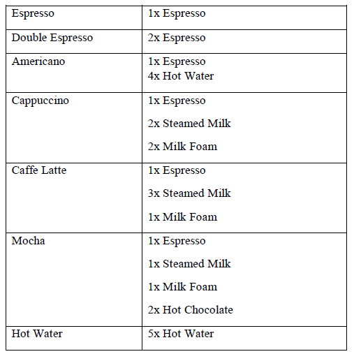
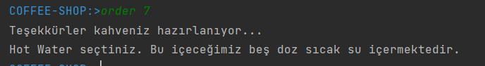
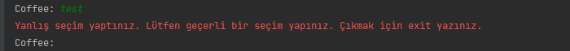

# Coffee Ordering App

This project was developed by Spring Boot. It is an application like CLI tool. 
User can see coffee menu and choose one of them by entering coffee type number.


## Commands

* menu
* order
* exit


## Running Coffee Ordering App locally

### With maven command line
```
git clone https://github.com/mustafacalik/coffee-shop.git
cd coffee-shop
./mvnw spring-boot:run
```


## Database configuration

In its default configuration, Coffee Ordering App does not have any database. It uses predefined json file for coffee data.



Json Schema Example

```json
  {
  "id": 5,
  "name": "Mocha",
  "price": 13,
  "ingredients": [
    {
      "name": "Espresso",
      "quantity": 1
    },
    {
      "name": "Buğulanmış Süt",
      "quantity": 1
    },
    {
      "name": "Süt Köpüğü",
      "quantity": 1
    },
    {
      "name": "Sıcak Çikolata",
      "quantity": 2
    }
  ]
}
```

## Application Screens

In order to see menu type **menu** command


Type order to order coffee and enter coffee number





Program will wait you enter right coffee number with error message as long as you type wrong one:




